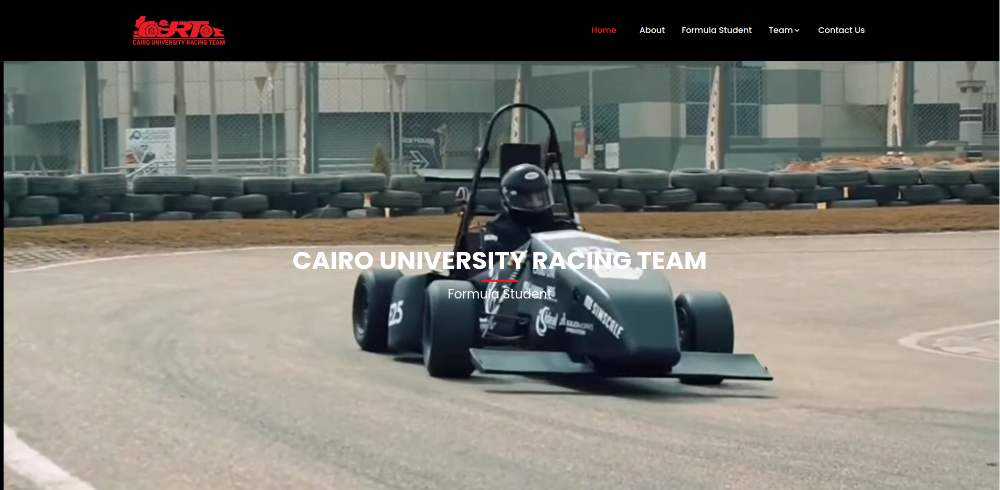

<h1 align=center>CURT - Formula Student Website</h1>
<p align=center>Developed by Ibrahim Mohamed - Autonomous Driving Director</p>
<h2 align="center"> <a target="_blank" href="https://curt-fs-website.vercel.app/" rel="nofollow">👀Live Preview</a> 
</h2>

<p align=center>
  <a href="https://github.com/vercel/next.js/releases/tag/v13.0.6" alt="Contributors">
    
  </a>
</p>



<!-- installation -->
## ⚙️Installation

After you clone this code, you have some prerequisites to install. Then you can run it on your localhost. You can view the package.json file to see which scripts are included.

### 🔧Install prerequisites

- **Node Installation:** [Install node js](https://nodejs.org/en/download/) [Recommended LTS version]

### 🖥️Local setup

After successfully installing those dependencies, open this template with any IDE [[VS Code](https://code.visualstudio.com/) recommended], and then open the internal terminal of IDM [vs code shortcut <code>ctrl/cmd+\`</code>]

- Install dependencies

```
npm install
```

- Run locally

```
npm run dev
```

After that, it will open up in your default browser, watch for changes to source files, and live-reload the browser when changes are saved.

## 🏗️Production Build

After finishing all the customization, you can create a production build by running this command.

```
npm run build
```
